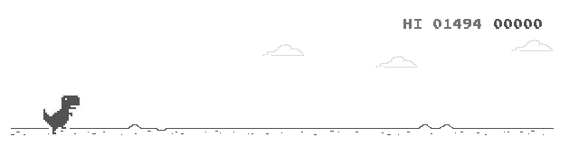

# ai-dino
This repository contains different implementations for the dino game.

# How to Use
Currently using this code is a little tricky. I recommend to wait for the future versions. However, these are the steps that you should follow:
1. Clone the project
2. Open [http://wayou.github.io/t-rex-runner](http://wayou.github.io/t-rex-runner) in your browser
3. Run the project and immediatly switch to the tab that you have just opened within 5 second (there is a line in the code that creates 5 seconds delay)
4. Press the 'space' button to start the game and do not switch between tabs
5. That's it! The project will capture an specific area of your screen and will call 'space' and 'down' keys according to the position of object.

# Implemented Algorithms
- The most simple and stupid algorithm ever by processing image and detecting objects using simple threshold

# Result
Highest Score: 1494

# Steps
Layer 1: Taking an screenshot of the game state:

Layer 2: Detecting dino by using OpenCV "match template":

Layer 3: Converting image from RGB to Grayscale

Layer 4: Removing background

Layer 5: Converting Grayscale to Binary

Layer 6: Doing bitwise operation

Final: Detecting countours and putting the detected dino (Layer 2) to the final image

# Future Works
- Getting higher scores by detecting the the current speed
- Implementing Deep Reinforcement Learning

# References
With special thanks to [t-rext-runner](https://github.com/wayou/t-rex-runner) which has implemented the game logic and provided an online [demo](http://wayou.github.io/t-rex-runner) of it.
